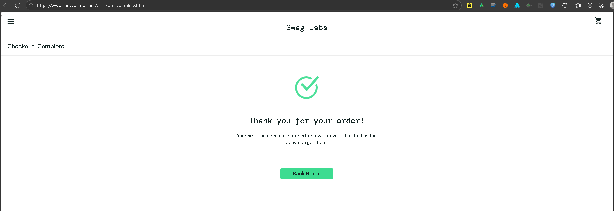

# Bug Report: Direct Access to Checkout Complete Page Without Purchase

**ID:** BR-01  
**Severity:** Critical  
**Priority:** High  
**Environment:** Chrome 120, Windows 11  
**Reproducibility:** 100%

## Description
Users can directly access the order confirmation page by manually entering the URL, bypassing the entire purchase workflow. This exposes a logical flaw in the application's state management.

## Steps to Reproduce
1. Log in with valid credentials (`standard_user` / `secret_sauce`)
2. **Do not add any items to the cart**
3. **Do not proceed through checkout**
4. Manually navigate to: `https://www.saucedemo.com/checkout-complete.html`
5. Observe the page displayed

## Expected Result
User should be redirected to an appropriate page (e.g., cart page, product page) or shown an error message indicating that no order was placed. The application should validate the order workflow state.

## Actual Result
The "Thank you for your order!" page is displayed with all confirmation elements as if a real purchase was made.

## Impact
1. **Security/Logic Flaw:** Users may believe they made a purchase when they did not
2. **Business Logic Bypass:** Entire payment and shipping information steps are skipped
3. **User Confusion:** Potentially leads to support requests and loss of trust

## Evidence

*Screenshot showing confirmation page without actual purchase*

## Additional Notes
- Tested on Chrome, Firefox - reproducible in both
- Session state does not prevent this access
- No validation of cart contents before displaying confirmation
